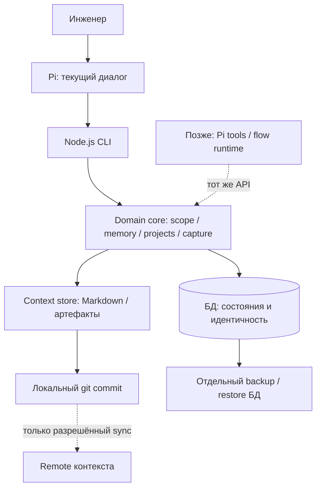
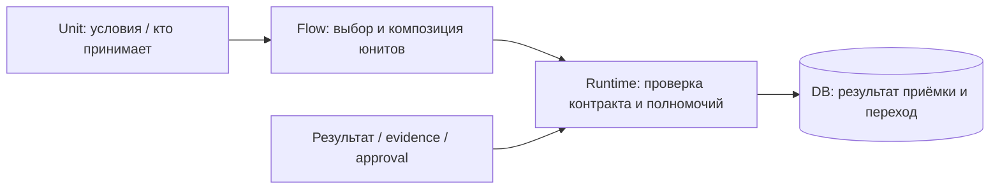
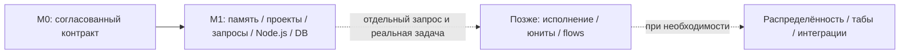

# mypi — архитектура и стратегия реализации

> **M0 закрыт: 2026-09-30, архитектурный контракт принят инженером.**
> Приняты: Node.js, состояния в БД, Markdown для контекста, обычная работа без обязательного учёта, scoped warmup без общего inbox, первая поставка — память и проекты, включая простой учёт запросов инженера (уточнение M1: 2026-10-01). Будущая приёмка определяется юнитом и выбранным flow, не глобальным требованием human approval.
> Исходные ответы, запись приёмки (§8) и технические вопросы M1 — [M0-CONTRACT.md](M0-CONTRACT.md). БД в git не хранится: граница Q5 подтверждена. Название `unit` / «юнит» принято. Реализация M1 разрешена отдельным ответом «начинай» и начата — [M1-IMPLEMENTATION.md](M1-IMPLEMENTATION.md). Исходник legacy Python-прототипа сохранён, но его CLI и bootstrap отключены при переключении на Node; актуальный цикл — [M1-CYCLE.md](M1-CYCLE.md).

## 1. Стратегия

**Сначала самостоятельная система памяти и проектов на Node.js: управляемое состояние запросов инженера — в БД; знания и контекст — в Markdown. Приняты папка задачи с исходником/артефактами и общий JSONL-журнал истории с ротацией, без индексации — M1-REQUESTS, §7. Flow и сабагенты добавляются позднее, по реальным задачам.**

Из прежнего предложения исключены:

- Файловый request lifecycle как обязательный промежуточный этап перед БД.
- БД как восстанавливаемый из Markdown кэш оперативного состояния.
- Обязательная ручная приёмка каждого результата.
- Один агентный workflow как минимально необходимая первая поставка.
- Python domain core, вызываемый будущим TypeScript-extension через subprocess.

БД нужна с начала новой реализации, но это не означает обязательный облачный PostgreSQL или поддержку нескольких устройств. **При подготовке M1 выбран стек: TypeScript strict, Node.js 24 LTS, ESM/tsc, SQLite + `better-sqlite3`, pnpm; SQL-миграции без ORM и тесты на `node:test` + `node:assert/strict`.** Запись принятия — [M1-DESIGN.md, §11](M1-DESIGN.md#11-принятие-стека). Минимальная схема/ограничения, путь БД, partial-контракт и стартовые бюджеты приняты в [M1-START.md](M1-START.md). Версии/совместимость проверены; модули M1 и CLI, импорт/backup/restore и локальный ограниченный запуск реализованы. Актуальный срез и оставшиеся ограничения — M1-CYCLE.

Документ различает:

- **Принято** — решения инженера в M0 и последующие явные уточнения M1; простой учёт запросов — [M1-REQUESTS.md](M1-REQUESTS.md).
- **Предложение** — конкретизация реализации этих решений, ещё не утверждённая схема/API.
- **Факт legacy** — наблюдение прежнего кода, не гарантия новой системы.
- **Позже** — направление расширения, не условие готовности памяти и проектов.

## 2. Назначение и scope первой поставки

| Сценарий | Входит в первую поставку | Граница |
|---|---|---|
| Зарегистрировать проект/организацию, найти checkout | Да | Без обязательного tracker/model/host-конфига |
| Сохранить и прочитать память global/org/project | Да | Факты и инструкции в контекстных файлах |
| Journal, errors, notes, glossary/артефакты | Да | Адресуемые знания и исходы, не оперативная state machine |
| Явный capture, просмотр inbox | Да | Исходная формулировка сохраняется; ничего не запускается |
| Warmup выбранного scope | Да | Чтение контекста и индекса, без мутаций |
| Локальная история файлов и сохранение состояния | Да | Git для контекстных файлов, транзакции/backup для БД |
| Обычная работа агента без request | Да | Учёт не навязывается |
| Фиксация запросов инженера, статусов и текстового прогресса | Да | Карточка/статус в БД; артефакты в папке задачи, история в общем JSONL; без запуска исполнения |
| Execution queue, run/step/attempt | Нет | Только при появлении соответствующего исполнения |
| Flow, runner, reviewer, acceptance engine | Нет | Постепенно под задачи инженера |
| Multi-device, leases, табы, marketplace | Нет | Не строятся ради будущей возможности |

Не надо создавать таблицы всех будущих сущностей, DSL, агента-координатора или серверную инфраструктуру только потому, что в целевой архитектуре есть точка расширения.

## 3. Разделение данных

### 3.1. Два источника истины для разных категорий, не две копии одного состояния

| Категория | Источник истины | Чего не делать |
|---|---|---|
| Управляемые состояния, идентичность и структурированные связи | БД | Выводить актуальное состояние из Markdown или чата |
| Память, glossary, заметки, решения, исходы, инструкции | Контекстные файлы, обычно Markdown + git | Делать из journal очередь выполнения |
| Опубликованные планы/отчёты/доказательства | Адресуемые версии артефактов | Перезаписывать использованное доказательство задним числом |
| Код рабочих проектов | Git соответствующего checkout | Копировать код в home или автоматически менять ветку основного клона |
| Сессия Pi | Локальный разговор/диагностика | Использовать как единственное хранилище состояния |
| Внешний tracker | Внешняя система, связанная с внутренними записями | Делать ticket условием обычной работы |

**Минимальная предметная DB-модель M1: organizations, projects, requests, request_statuses.** Принято простое сохранение запросов инженера, их статусов и прогресса; логические поля DB-карточки и папка контекста приняты в [M1-REQUESTS.md](M1-REQUESTS.md), §6; размещение истории уточнено в §7, помесячная UTC-ротация принята в §12. Метаданные хранятся в requests, исходник/артефакты — в папке задачи, история — в общем JSONL-журнале с ротацией. Выборки разрешают scope по БД и потоково читают нужные файлы; SQL-копию истории и индексацию не вводим. Начальные 10 статусов приняты в M1-REQUESTS §3.3/§11. Принят справочник request_statuses(id, code, is_terminal) и FK requests.status_id → request_statuses.id (§18/§19): переименование code не меняет карточки; при создании агент/инженер явно задаёт статус, без is_initial/default (§20); допустимость/терминальность читаются из БД, добавление статуса не требует миграции схемы. Фиксированный enum/CHECK IN не вводится; research/planning/review доступны уже в M1, но не образуют обязательный pipeline. Запросы без проекта разрешены (§16 M1-REQUESTS): project_id допускает NULL без фиктивного проекта; ключи REQ-number, отдельная общая нумерация и home/requests/ приняты в §2.5/§17. REQ зарезервирован и не выдаётся проектам; история остаётся scope=request, без родительского проекта/org и без подмены на global. Для id всех четырёх таблиц принят INTEGER PRIMARY KEY (§21); остальные поля/типы/constraints и BEGIN IMMEDIATE-нумерация приняты в M1-START (§22 M1-REQUESTS). Предварительный capture не обязателен.

Предложение DB-capture, универсальных operations/operation_files и recovery engine в [M1-STORAGE.md](M1-STORAGE.md) отозвано как преждевременное усложнение. Capture сохраняет исходный текст; legacy-inbox не переводится автоматически в requests. MEMORY, journal, notes и прочие знания остаются файловым контекстом.

Будущие runs, steps, attempts, проверки и результаты приёмки добавляются в БД **после появления соответствующей функции**. Текущая запись request не зависит от выбранного flow; нужные поля/отношения появятся с реальной реализацией и миграцией схемы.

### 3.2. Логическое размещение

```text
mypi/                              # git движка
├── scripts/                       # build/checks; отключённые legacy entrypoints
├── docs/, adr/, references/
├── [будущий Node.js core/CLI/tests]
├── home/                          # отдельный git контекста инженера
│   ├── MEMORY.md
│   ├── journal/YYYY-MM.jsonl # общий журнал; календарный месяц UTC
│   ├── requests/REQ-<number>-<english-slug>/ # запросы без проекта, без отдельного журнала
│   ├── notes/
│   └── projects/                   # контекст, не рабочие клоны
│       └── <org>/
│           ├── MEMORY.md
│           └── <project>/
│               ├── MEMORY.md, context.md
│               ├── errors.md
│               ├── requests/<CODE>-<number>-<english-slug>/ # без отдельного журнала
│               └── notes/, adr/, ai/<slug>/
└── projects/                      # необязательные рабочие клоны

$XDG_STATE_HOME/mypi/              # вне git; fallback: ~/.local/state/mypi/
└── state.sqlite3                  # авторитетное состояние
```

Mutable DB, WAL/locks, сокеты и credentials не коммитятся ни в движок, ни в git контекста. Принят путь $XDG_STATE_HOME/mypi/state.sqlite3, без XDG_STATE_HOME — ~/.local/state/mypi/state.sqlite3 (M1-START §2). Отдельного поля пути БД в конфиге нет. DB-backup тоже не означает синк mutable DB через git.

Legacy `home/projects.json` и `home/inbox.md` — источники миграции. После миграции не должно остаться двух активных паспортов/жизненных циклов. Пока Node-реализации нет, Python-прототип продолжает использовать свои исходные файлы.

Целевой root уточнён инженером: `home/projects/<org>/<project>/` (M1-REQUESTS, §9); орг-память — `home/projects/<org>/MEMORY.md`, общая — `home/MEMORY.md`. Это вложенный context git, не системный `/home` Linux и не рабочие клоны `<mypi>/projects/`. Прежние `home/<org>/<project>/`, их Markdown-журналы и `home/knowledge/` остаются legacy-входом; перенос/удаление без разрешённой миграции запрещены.

### 3.3. Identity и checkout

Для проектных запросов принято трекерное именование: код проекта, инкремент номера в проекте и английский slug (`MP-23-task-name-example`). Разделение короткого ключа/имени, уникальность кода и правила выдачи номеров приняты в M1-REQUESTS §2.4/§15; логические дополнения — projects.code и requests.number, без копий ключа/slug/ветки. Это не разрешение работы с ветками. Полная JSONL-оболочка принята там же в §3.6/§14: обязательные at/scope/event_type/text, необязательный artifacts с путями относительно home. Event_type (note/request_created/status_changed) принят в §13, назначается CLI по операции для фильтрации, без запуска flow; scope global/org/project/request, поля type/key и семантика выборок §3.7 приняты (запись §10). global — адресат общей записи, не синоним режима «весь журнал».

`org/project` — переносимая идентичность; локальный путь — способ найти код на этой машине, не identity. Путь выясняется при действии; при неоднозначности агент спрашивает, а не добавляет конфиг «на будущее». Только необходимая локальная привязка хранится локально.

ID состоит из двух безопасных сегментов. Путь проверяется после разрешения символических ссылок; `..`, абсолютный ID и выход за разрешённый root не принимаются. Проверяются ввод, мигрируемый паспорт и прочитанные данные, не только одна команда `project add`.

### 3.4. Что даёт детерминированность

Не формат `.db` сам по себе, а:

- Типизированные/валидируемые команды и ограничения схемы.
- Уникальность identity, ссылочная целостность и транзакционные изменения.
- Проверка ожидаемого состояния/ревизии при конкурирующих изменениях.
- Идемпотентность повторяемых операций и явные результаты ошибок.
- Версионированные миграции, backup и проверенный restore.
- Одна реализация правил для CLI и будущих Pi tools/flow.

Не требуется заранее event sourcing, распределённый журнал или ORM. Транзакции обычной локальной БД достаточны для первой модели, если её инварианты явно заданы.

LLM-ответ может оставаться вероятностным. Runtime должен детерминированно решать, допустим ли переход по фактическому результату и выбранному контракту, а не подменять результат своим предположением.

## 4. Компоненты Node.js

Уточнение подготовки M1: инженер выбрал **pnpm** и **модульный монолит по предметным областям + Ports & Adapters + сценарии внутри модулей**. Принятые предметные границы, организация каталогов и правила зависимостей — [M1-DESIGN.md](M1-DESIGN.md); запись выбора — §10, последующее принятие стека — §11. Эти решения не разрешают реализацию.



| Компонент | Ответственность |
|---|---|
| CLI | Разбор аргументов, читаемый/машинный результат, exit status |
| Domain core | Валидация scope/identity, правила операций, права и preconditions |
| State store | DB-транзакции, запросы, миграции, ограничения, backup/recovery |
| Context store | Безопасные пути, работа с текстом, адресуемость, отсутствие silent overwrite |
| Git adapter | Локальная история ровно затронутых контекстных данных; отдельный сетевой sync |
| Будущий Pi adapter | Вызов того же core, а не новая копия доменной логики |

Все новые компоненты — TypeScript с компиляцией в JavaScript для Node.js 24 LTS; CLI и будущие входные адаптеры используют один модульный API. Не нужен отдельный daemon/server для использования библиотеки из CLI; будущий extension может использовать тот же Node API.

## 5. Сохранение, commit и recovery

### 5.1. Принятая граница сохранения

Принято Q5: локальное сохранение и отдельно разрешённый сетевой sync. Инженер дополнительно подтвердил: «согласен, базу в git не храним». Граница между git-контекстом и DB-состоянием согласована:

- Контекстные файлы: безопасная запись и локальный **git commit**.
- Только DB-состояние: **DB commit**, без пустого git commit, сериализации всей БД или искусственного MD-журнала прогресса.
- Смешанная операция: DB + файловая запись + git; явный восстанавливаемый протокол.
- Ни один локальный commit не означает, что backup или remote sync уже сделан.

Ссылаться на Q5 как на разрешение коммитить бинарную SQLite в home нельзя. Git памяти также не даёт разрешения коммитить код движка/рабочих проектов.

### 5.2. Смешанная операция не атомарна автоматически

SQL-транзакция не включает filesystem и git. DB-only изменение не требует файловой проекции. Карточка запроса, файлы артефактов и общий JSONL-журнал делают создание/некоторые обновления request смешанным сценарием: DB, файлы и Git имеют разные результаты сохранения. В M1-REQUESTS, §6–7 принята эта граница; контракт partial с ненулевым exit code, подтверждёнными/оставшимися частями и продолжением после явной сверки принят в M1-START §3 (M1-REQUESTS §22).

Универсальные operation records и recovery engine заранее не вводятся. Для реальной команды, затрагивающей несколько границ сохранения, выбирается минимальный способ обнаружить частичный исход и безопасно продолжить. Проверяются фактические границы реализуемой команды, а не воображаемый workflow будущих flow.

Если файл записан, а git commit не прошёл, команда сообщает частичное выполнение и способ восстановления. Если произошёл DB rollback, вывод не утверждает успешное изменение состояния. Retry не должен дублировать capture, note или journal.

В commit нельзя незаметно включать чужой dirty diff. До удаления незакоммиченного материала нужен сохранённый preimage либо безопасный отказ: commit после удаления не создаёт отсутствующую историю старого текста.

### 5.3. Backup — два независимых контура

- Git сохраняет историю **закоммиченного контекста**; remote требует отдельной операции.
- БД требует собственного consistent backup и restore, включая связанные revision/artifact references.
- Для SQLite нельзя обещать корректный backup простым копированием живого файла без учёта WAL; используется поддерживаемый движком способ.
- Потеря DB при сохранном home не восстанавливает автоматически прогресс. Снимок MD — не гарантированно актуальная копия БД.
- Восстановление проверяет совместимость DB-состояния и адресуемых артефактов; отсутствие файла не маскируется успешным outcome.

Расписание, место и retention backup выбираются для реального использования M1, без создания облачной инфраструктуры заранее. Restore-test входит в готовность первой поставки.

## 6. Память и warmup

Принятый смысл Q4 — наследование общей памяти родителей, **не всего общего inbox**.

| Вход | Контекст |
|---|---|
| `warmup` | Global MEMORY, ограниченный индекс проектов и общего inbox |
| `warmup -s org` | Global/org MEMORY, индекс проектов этой организации |
| `warmup -s org/project` | Global/org/project MEMORY, glossary, последние исходы и пути к полным записям проекта |

Чтение ничего не создаёт и не изменяет. Связанный с проектом материал подгружается по существующим связям; не нужно добавлять поле capture только ради неподтверждённого сценария фильтрации. Общая MEMORY намеренно общая; это не sandbox организаций.

Warmup — индекс, не замена памяти. Ответ на «что было по X» требует полных записей/артефактов. Ограничение вывода не даёт сложности O(1): объём чтения и индексирование оцениваются отдельно по измерениям.

Journal хранит реальные исходы, errors — симптомы/ошибки/тупики, MEMORY — актуальные стабильные факты, notes — адресуемые заметки. Технические переходы будущего runtime не обязаны порождать project journal-entry. Для requests принят общий JSONL-журнал значимых изменений/прогресса с помесячной UTC-ротацией (`home/journal/YYYY-MM.jsonl`); файл создаётся при первой записи месяца, автоматического удаления истории нет. История задачи/проекта/организации — фильтрованная выборка по всем нужным файлам; индексации нет. Он не становится источником текущего DB-статуса и не обещает полный runtime audit.

## 7. Приёмка и будущие юниты

### 7.1. Термины

Инженером выбрано **unit / юнит** вместо `brick` и предложенного `agent module`. Не вводятся manifest filename, npm-prefix или config keys до выбора реального формата.

- Юнит — роль/инструкции + интерфейс + ограничения + правила приёмки.
- Сабагент — конкретный запущенный исполнитель.
- Flow — композиция юнитов и связей между их шагами.
- Runtime — проверяемый код исполнения и фиксации состояния.
- Pi extension — исполняемая интеграция; package — способ доставки, не синоним юнита.

### 7.2. Где живёт acceptance



Возможны автоматические проверки, другой агент, инженер или их сочетание — по контракту выбранного юнита. Нельзя навязывать human acceptance любому flow; нельзя и пропускать human approval, если конкретный юнит его требует.

Flow не должен молча ослаблять политику юнита или придумывать второй противоречащий критерий. Runtime проверяет объявленные требования, сохраняет результат и основание в БД. Одного exit code 0 или текста «готово» недостаточно.

Политика и её версия должны быть известны для конкретного запуска; её последующая правка не перепринимает прежний результат. Это требование к будущему runtime, не таблицы/DSL, которые надо реализовать в M1.

### 7.3. Учёт и исполнение остаются отдельными

Обычная работа разрешена без request. Capture, оформление учёта и запуск flow — разные намерения; ни MD-правка, ни git pull, ни чтение warmup сами не запускают работу.

Request, его текущий статус и progress уже входят в M1 как простой учёт. Когда появится управляемое исполнение, к нему добавятся run, step/attempt и process; их схема и state machine определяются тогда, а не заранее. Терминальные исходы не reopen-ятся; продолжение — новая связанная запись.

Глобальный путь `draft → backlog → shipping → acceptance → done` с обязательным инженером **не принят** и не является схемой будущей БД. Не нужно сохранять старый Markdown frontmatter как SQL-схему ради совместимости с прежней идеей.

### 7.4. Контракты и безопасность, когда появится flow

Для связи A → B проверяется:

```text
requiredInputs(B) ⊆ availableMappedOutputs(A) ∪ explicitFlowInputs
```

Проверяются mapping, типы и фактический output; существование валидного report/evidence не следует из одной строки пути. Конфигурация/роль не гарантируют безопасность: bash, scripts и extensions пересекают границу исполнения кода.

`cwd` и инструменты не дают filesystem sandbox. Дерево процессов не даёт эксклюзивного ownership. Конкретный runner/версия, headless approvals, отмена, cleanup и изоляция проверяются перед их использованием, но не разрабатываются в первой поставке.

Внешние изменения в GitHub/YouTrack — только по явному запросу с указанием цели. Автоматическая приёмка результата не расширяет эти полномочия.

## 8. Pi — что известно и что отложено

По локальной документации Pi 0.87.1 подтверждены extensions, custom tools/commands, события, JSON/RPC, SDK и packages. Пример `examples/extensions/subagent/` показывает отдельный Pi-процесс, single/chain/parallel и штатную отмену.

Отдельный пакет `nicobailon/pi-subagents`, кастомный runner yokemate и пример Pi — не один API. Возможности `allowedAgents`, watchdog, permission и acceptance из вторичного reference надо проверить на конкретной версии. Ни выбор пакета, ни его установка сейчас не требуются.

Для будущей интеграции важно: JSON — односторонний event stream, не RPC; ошибка модели не обязательно даёт ненулевой process exit; `agent_settled` отличается от `agent_end`; JSON/print не предоставляют интерактивный UI. Context в home и cwd рабочего клона также различаются.

Будущий Node/Pi adapter использует тот же domain core. Переписывать Pi, копировать его session state в MD или заранее запускать root→org→project LLM-каскад не нужно.

## 9. Майлстоуны после решения Q6



### M0 — согласованный контракт

Принятые решения — [M0-CONTRACT.md](M0-CONTRACT.md). Граница Q5 закрыта: БД вне git, backup отдельно. Термин `unit` / «юнит» согласован. Принята [политика тестирования](TESTING.md); стартовые численные бюджеты приняты в TESTING §6/§11, локальный механизм ограничений реализован, его границы описаны в M1-IMPLEMENTATION. M0 закрыт по итоговому подтверждению инженера (§8 контракта); отдельный запрос на реализацию M1 получен («начинай»). Отложенный в M0 выбор стека выполнен при подготовке M1 (M1-DESIGN, §11); минимальная схема, путь БД и partial-контракт приняты последующим пакетом M1-START, без универсального recovery engine.

### M1 — первая полезная поставка: память и проекты

**Scope:** Node.js CLI/core, реестр организаций/проектов и простой учёт запросов (карточка/статус в БД, исходник/материалы в папке задачи, история в общем JSONL-журнале с ротацией), Markdown context store, безопасные файловые операции, локальная история по Q5, миграция legacy-данных, backup/восстановление реальных операций и тесты.

**Выход:**

1. Bootstrap и все текущие пользовательские сценарии работают без Python backend; отсутствующая/повреждённая БД не подменяется пустым успешным состоянием.
2. Есть минимальная версионированная схема organizations/projects/requests/request_statuses, миграции, constraints, транзакции и защита от конкурентной потери обновления. Запрос можно сохранить, прочитать и изменить его статус/progress без автоматического исполнения.
3. Legacy projects/inbox/knowledge импортируются без потери source; повторный импорт не дублирует записи, исходники сохранены для проверки/отката.
4. Memory/journal/errors/notes/warmup сохраняют смысл; нет traversal, silent overwrite, скрытой записи при чтении и отсутствующего journal outcome в индексе.
5. Scoped warmup не подмешивает общий inbox; данные БД и контекст читаются через явные границы. Выборки общего JSONL-журнала учитывают файлы ротации и фильтруют scope до выдачи агенту, без поискового индекса.
6. Git commit и DB commit имеют понятный результат; mixed-operation recovery не повторяет side effects; сеть не вызывается как скрытое следствие локального изменения.
7. DB backup/restore и git-восстановление контекста проверены отдельно и совместно на ссылочной согласованности.
8. Есть автоматические тесты Node.js по [TESTING.md](TESTING.md); обязательный `verify` проходит в согласованном бюджете, ограничения запуска проверены. Ошибки и незавершённые операции воспроизводимы и диагностируемы.

**Не входит:** автоматическое исполнение requests, агентный runner, flow DSL, шаблон всех будущих SQL-таблиц, универсальный recovery engine, глобальная policy приёмки, tracker, несколько машин.

### После M1 — только по необходимости

Прежние M2–M7 не являются обязательной очередью разработки. Возможные следующие направления: расширение учёта запросов под реальное исполнение; первый юнит с нужной приёмкой; композиция flow; повторное использование юнитов; внешние интеграции; распределённость/табы. Порядок выбирается по задаче инженера.

Если появляется multi-device execution, ownership и защита от устаревшего владельца нужны **до** второго автономного writer. Локальный SQLite не обещает прозрачного превращения в PostgreSQL, а git-sync контекста не переносит DB-состояние автоматически.

## 10. Реализованный legacy и аудит

### 10.1. Что есть сейчас

`scripts/mypi.py` — Python stdlib CLI, `scripts/bootstrap.sh` — bootstrap home. В этом legacy-прототипе память и паспорт — файлы; транзакций, automatic commits и БД нет. Этот аудит относится к прежнему коду. Теперь реализован Node package со всеми предметными модулями M1 (M1-CYCLE); legacy entrypoints отключены. В текущем checkout личный home/ не создавался. Независимая итоговая приёмка ещё не выполнена.

Исторические команды: warmup, capture, journal, error, memory add/show/remove, note, project add/list. Текущий исполняемый вход — Node CLI (M1-CLI); Python больше не редактирует данные.

### 10.2. Реестр замечаний исходного аудита и их актуальное значение

В — воспроизведено на Python-прототипе; К — анализ кода; Д — сопоставление документов. Изменение контракта не означает исправление runtime.

| № | Тип | Наблюдение исходного аудита | Актуальное значение |
|---|---|---|---|
| A01 | Д/В | Knowledge-root различается в AGENTS/CONCEPT/bootstrap | Документы согласованы; legacy и миграция — M1 |
| A02 | В | Scoped warmup без inbox и без тела journal | Отсутствие общего inbox теперь правильно по Q4; отсутствие outcome/path исправить в M1 |
| A03 | Д/К | Заявлен O(1), читаются растущие данные | Обещание отозвано; bounded output и измерения |
| A04 | В | Traversal ID, traceback без `/`, лишние сегменты | Безопасная Node-валидация и миграция; M1 |
| A05 | В | Journal/error принимают org вместо project | Общая проверка project scope; M1 |
| A06 | В | Note с той же темой в день перезаписывается | No-overwrite; M1 |
| A07 | В | Memory show создаёт файл | Чтение без мутаций; M1 |
| A08 | В | Multiline capture теряет продолжение в индексе | Source preservation и явный record format; M1 |
| A09 | В/К | CLI не commit-ит | Q5 согласован: файлы — git commit, DB — транзакция вне git; реализация M1 |
| A10 | В/К | Bootstrap возвращает 0 после failed pull | Различать local-ready/sync-failed; новая bootstrap-логика M1 |
| A11 | К | Нет locks/atomic write/schema validation | DB constraints/transactions + безопасный context store; M1 |
| A12 | Д/К | Абсолютный path не переносим | Identity отдельно от локального resolution; без multi-device в M1 |
| A13 | Д | Несогласованные lifecycle statuses | Глобальная state machine сейчас не утверждается; проектировать при появлении учёта |
| A14 | Д | БД одновременно authority и disposable projection | Решено Q1: DB authoritative для состояния, MD для контекста |
| A15 | Д | Каждый переход статуса приравнен к outcome | DB audit отдельно от журнала знаний |
| A16 | Д | Immutable artifacts смешаны с mutable knowledge/status | Разные контракты; DB status не фронтматтер MD |
| A17 | Д | Смешаны Pi example, yokemate и pi-subagents | Источники помечены; runner проверяется позже |
| A18 | Д/К | Дерево процессов приравнено к ownership/cleanup | Гарантия отозвана; проверяется при появлении runner |
| A19 | Д | Каскад глубже default recursion limit | Каскад не обязателен; реальный runner — позже |
| A20 | Д | Data-bricks названы безопасными при bash/scripts | Название и формат не дают доверия; не входит в M1 |
| A21 | Д | Неверное направление output/input subset | Уточнён контракт; валидатор нужен только с flow |
| A22 | Д | Context cwd и workspace cwd смешаны | Передавать раздельно при реализации runner |
| A23 | Д | Pi-hook не покрывает CLI/import/git | Один domain core; изменение контекста не запускает flow |
| A24 | Д | Done автоматически обновляет tracker | Приёмка не даёт внешних полномочий |
| A25 | Д | Табы/packaging/workflows описаны как гарантированно готовые | Это будущие проверки, не требования первой поставки |

## 11. Стратегия проверки новой реализации

Принятая политика — [TESTING.md](TESTING.md). Два профиля исполнения: `fast` и `boundary`; обязательный `verify` включает оба и admission checks. Стартовые численные бюджеты приняты (TESTING §6/§11), локальные ограничения реализованы и проверены; срез измерений и границы защиты — M1-IMPLEMENTATION, это не p95/baseline всей M1. Политика применяется с первым вертикальным срезом разрешённой M1, не после разрастания suite.

Таблица ниже перечисляет области защиты, не отдельные runners или дублирующие suites. Матрицы проверяются на минимально достаточном уровне; настоящие границы — ограниченными canaries.

| Область | Что доказываем в M1 |
|---|---|
| Domain unit | Scope/identity, допустимость команд, отсутствие неявного учёта |
| DB integration | Constraints, rollback, конкурентные операции, повторяемость и миграции |
| Context integration | UTF-8/multiline, безопасные пути, no-overwrite, read-only команды |
| Git integration | Только собственный diff, checkpoint failures, отсутствие неразрешённой сети |
| Cross-store recovery | Падение между SQL/file/git, retry без duplicate side effects |
| Legacy migration | Повторный импорт, сохранность исходников, неизвестный формат, отсутствие двух активных паспортов |
| Backup/restore | Реальное восстановление DB и согласованность ссылок с git-контекстом |
| CLI/API + boundary canaries | Все старые полезные сценарии на Node, без Python, с понятными ошибками; разбор/dispatch через API, launcher/stdio/exit и подключение — настоящими процессами без повторения полных матриц |

Будущие contract tests Pi/юнитов/flow, policy acceptance и distributed ownership добавляются при появлении функций; они не блокируют первую систему памяти.

## 12. Запись проведённой проверки legacy

Ниже сохранены результаты исходного аудита Python-прототипа. Они не являются тестами новой архитектуры или подтверждением её реализации.

### Объём и метод

Прочитаны все отслеживаемые текстовые файлы проекта, включая три ADR, оба reference, draft bricks и оба скрипта. Выполнены Python AST parse и `bash -n`.

CLI запускался subprocess-ами на **временной копии `scripts/`**, со свежим вложенным git, временной директорией клона и локальной git identity. Сеть, реальные tracker, LLM workers и чужие рабочие репозитории не использовались. Временная копия после проверки удалена; рабочий `home/` не создавался.

### Подтверждённые наблюдения

- Bootstrap создаёт вложенный git и устаревшие global `journal/knowledge/`.
- Работают project add/list, capture, memory add/show на трёх scope, memory remove, journal newest-first, error, note и наследование parent memory.
- Неизвестный scope отклоняется; warmup без home возвращает понятную ошибку.
- Воспроизведены A02, A04–A10: отсутствие inbox/outcome в scoped warmup; traversal, malformed/multi-segment project ID; org вместо project; overwrite заметки; запись при show; обрезанный multiline draft index; отсутствие commit; нулевой exit после failed pull.
- Все проверки наблюдаемого поведения завершились успешно. Это означает **воспроизводимость как рабочих сценариев, так и дефектов**, не прохождение будущих acceptance tests.

### Ключевые воспроизведения

Ниже команды только для одноразовой копии scripts с отдельным home; не запускать traversal-проверку на рабочих данных.

| Подготовка / действие в temp copy | Наблюдение |
|---|---|
| `project add acme/demo <temp-clone>`; `journal acme/demo SECOND_OUTCOME`; `warmup -s acme/demo` | В warmup дата/`no ticket`, но нет `SECOND_OUTCOME` |
| Дважды `note -s acme/demo "Same title" ...` с FIRST_NOTE и SECOND_NOTE | В одном файле остался только SECOND_NOTE |
| `project add ../outside <temp-clone>` | Создан `<temp-mypi>/outside/context.md`, вне home |
| `project add malformed <temp-clone>` | Traceback вместо контролируемой ошибки |
| `project add acme/deep/name <temp-clone>` | Некорректный ID принят |
| `journal acme ORG_OUTCOME`; `error acme ORG_ERROR` | Записи на org-уровне приняты |
| `memory -s acme/fresh show` после add нового проекта | Создан отсутствовавший MEMORY.md |
| Capture одного аргумента с переводом строки, затем `warmup` | В исходнике обе строки, в индексе только первая |
| Изменения CLI, затем `git -C <temp-home> status --porcelain` | Изменения остались незакоммиченными |
| Повтор bootstrap существующего git-home без remote с непустым `MYPY_HOME_REMOTE` | Предупреждение failed pull, exit code 0 |

### Что не проверено

Нет проверки реального remote, второй машины, конкурентных записей/аварий диска, установленного pi-subagents, вызова LLM, PostgreSQL, tracker, sandbox и табов. Для них зафиксированы риски и критерии будущих этапов, а не заявлена работоспособность.

Project journal в этой сессии не записан: в checkout нет home и паспорта mypi. Не создавались личное хранилище и регистрация проекта ради аудита. Устойчивый артефакт исхода — этот документ и исходные наблюдения выше.

## 13. Источники и статус решений

- [M0: исходные ответы, принятые решения и открытые вопросы](M0-CONTRACT.md).
- [README](../README.md), [PLAN](../PLAN.md), [AGENTS](../AGENTS.md) — актуальные границы; [CONCEPT](../CONCEPT.md) сохраняет историю концепции с уточнением M0.
- [CLI legacy](../scripts/mypi.py), [bootstrap legacy](../scripts/bootstrap.sh), [.gitignore](../.gitignore).
- [ADR-0001](../adr/ADR-0001-three-layers-files-db-tracker.md), [ADR-0002](../adr/ADR-0002-plugin-subagents-on-pi-primitives.md), [ADR-0003](../adr/ADR-0003-orchestrator-cascade.md) — исходные proposed-документы с явными поправками M0, не принятые целиком.
- [Исторический набросок юнитов](subagent-brick-architecture-proposal.md) — прежний термин сохранён в стабильном пути, не выбран для нового API.
- [Pi extensions reference](../references/pi-extensions-reference.md), [pi-subagents reference](../references/pi-subagents-reference.md) — вторичные версионированные сведения, не гарантия совместимости.

Локальные первоисточники Pi, прочитанные при исходном аудите: `/home/priney/.local/share/mise/installs/pi/0.87.1/pi/`, `README.md`, `docs/index.md`, `docs/extensions.md`, `docs/packages.md`, `docs/sdk.md`, `docs/configuration.md`, `docs/security.md`, `docs/cli.md`, `docs/cli-integration.md`, `docs/json.md`, `docs/tui.md`, `examples/extensions/subagent/README.md`; проверен `runSingleAgent` в `examples/extensions/subagent/index.ts`. Это provenance аудита, не конфигурационные пути mypi.

Запись исходной редакции M0 (последующий выбор стека — M1-DESIGN, §11):

NorthStar и исходный код yokemate-pi отдельно здесь не аудировались. Изменения этой редакции — документация решений инженера, а не повторный runtime-аудит. Конкретный DB-движок и механизм cross-store recovery не выдаются за уже реализованную или полностью принятую систему; решения хранить БД вне git и использовать термин `unit` приняты отдельно.
